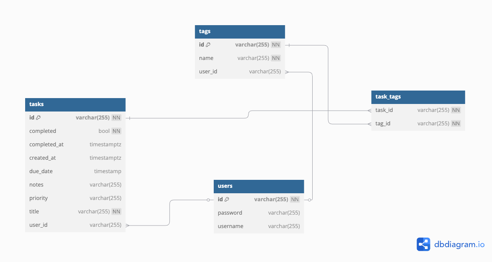

# Task Management API

This is a simple task management API built with Spring Boot, Hibernate and PostgreSQL.

## Endpoints

### Authentication

- `POST /auth/login`: Login and get access token.
- `POST /auth/register`: Register a new user.
- `POST /auth/refresh`: Refresh expired access token.

### Tasks

- `POST /tasks`: Create a new task.
- `GET /tasks`: Get all tasks.
- `GET /tasks/{id}`: Get a task by id.
- `PUT /tasks/{id}/complete`: Update a task to complete.

### Tags

- `GET /tags`: Get all tags.

## Features

- User authentication and authorization.
- Task management (CRUD).
- Task-Tag relationship management.
- Database is PostgreSQL.
- Database schema is defined in `database.dbml`.

## ERD (Entity Relation Diagram)

## Testing

### Integration Testing

To run integration tests, you need to install PostgreSQL and have it running on port 5432.

1. Clone the repository.
2. Add .env.test file (adjust with your config).
3. Update the `application-test.properties`.
4. Run `docker compose --env-file .env.test up -d db` to start the database for testing.
5. Make sure `db_task_test` database exist (if not, create it).
6. Run the integration tests with `mvn test`.

## Running

To run the API, you need to have Java 11 and PostgreSQL installed.

1. Clone the repository.
2. Add .env file (u can see env.dev for template).
3. Update the `application.properties`.
4. Run the API with `mvn spring-boot:run`.
5. Access the API at `http://localhost:8080`.
6. Access the API documentation at `http://localhost:8080/swagger-ui/index.html`.

## Circuit Breaker

The application implements the Circuit Breaker pattern to improve the resilience of the API calls. This pattern helps in preventing system failures by stopping the invocation of a service that is likely to fail. It is implemented using the Resilience4j library.

### Circuit Breaker Endpoints

- The application includes an endpoint to test the circuit breaker functionality:
  - `GET /api/test`: Calls the target API and triggers the circuit breaker on failure.

### Circuit Breaker Configuration

- The circuit breaker is configured using annotations in the `ApiClientService` class.
- It includes a fallback mechanism to handle failures gracefully.

- The circuit breaker configuration is defined in the `application.properties` file with the following properties:
  - `resilience4j.circuitbreaker.instances.apiClientService.failureRateThreshold`: The failure rate threshold.
  - `resilience4j.circuitbreaker.instances.apiClientService.slidingWindowSize`: The sliding window size.
  - `resilience4j.circuitbreaker.instances.apiClientService.slidingWindowType`: The sliding window type.
  - `resilience4j.circuitbreaker.instances.apiClientService.permittedNumberOfCallsInHalfOpenState`: The permitted number of calls in half open state.
  - `resilience4j.circuitbreaker.instances.apiClientService.waitDurationInOpenState`: The wait duration in open state.
